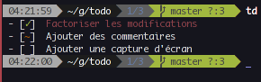

todo.cpp
========

Todo list program

Usage : todo [show,add,remove,check,set]

todo use the file named ".todo.txt" in the current dir. So you can use many todo-list, one per directory.
They have no ID system. For select a task, just type it or a part of it.
You can add priority for each task "todo add priority task" or "todo set priority task-part"
To check a task type "todo check todo-part"

If many tasks contains the todo-part, all of it will be selected.
 
Exemple of how you can use it :
-------------

